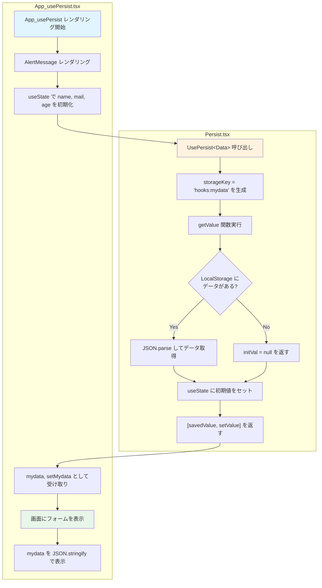
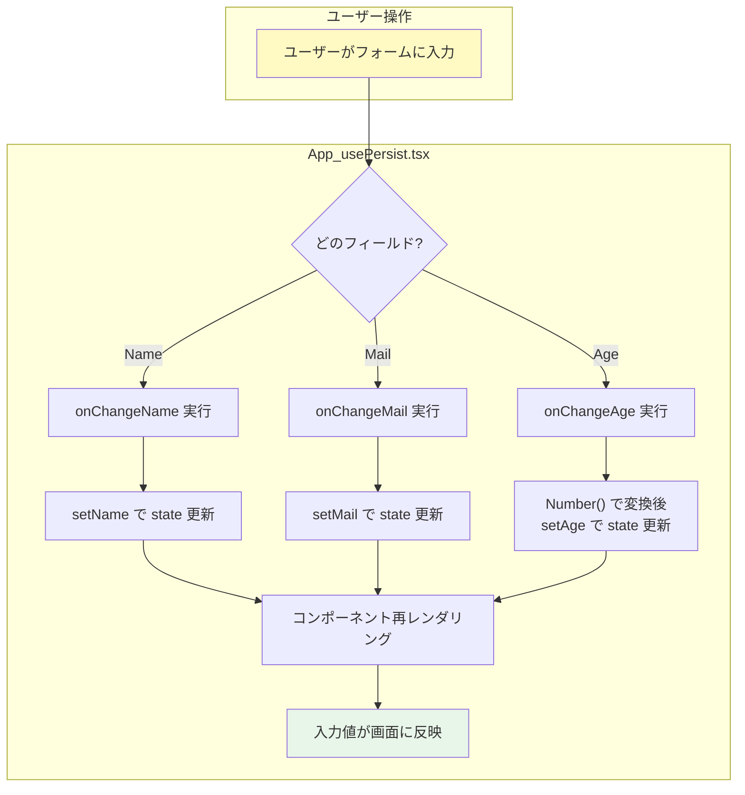
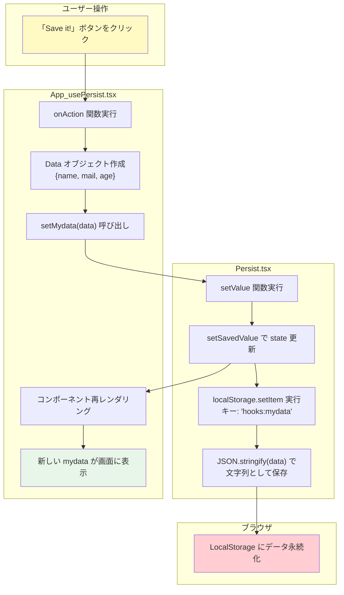
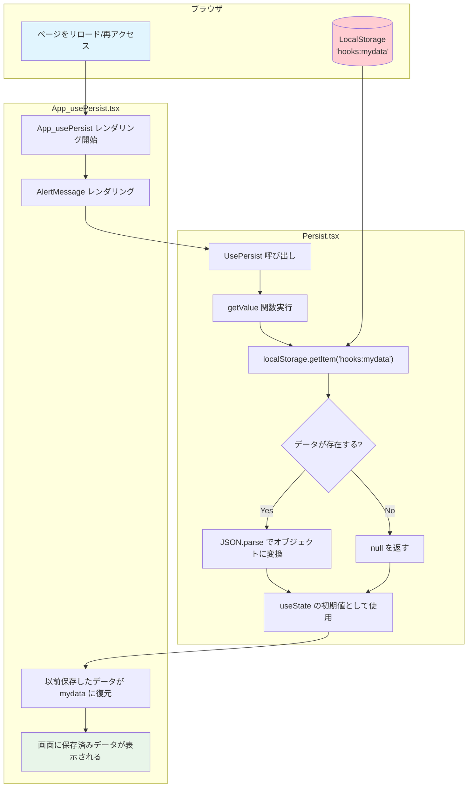
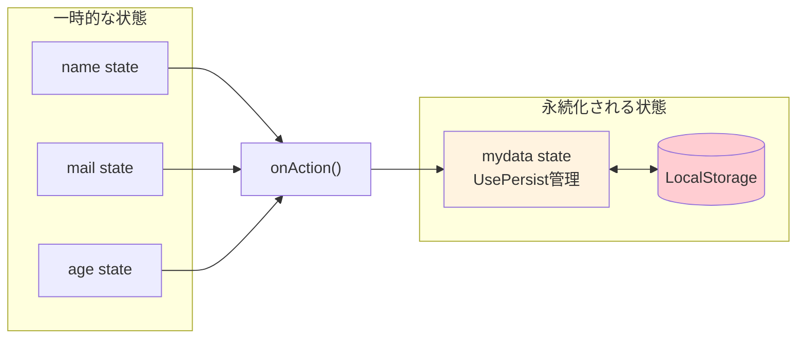

# コンポーネント永続化フロー

`App_usePersist.tsx` と `Persist.tsx (UsePersist)` の動作フローを説明します。

## ファイル構成

```
App_usePersist.tsx (UIコンポーネント)
    └── UsePersist.tsx (カスタムフック)
            └── LocalStorage (ブラウザストレージ)
```

---

## 1. 初回レンダリング時のフロー



---

## 2. ユーザー入力時のフロー



> **ポイント**: この時点ではまだLocalStorageには保存されない。
> state（name, mail, age）は一時的な入力値を保持しているだけ。

---

## 3. 保存ボタンクリック時のフロー



---

## 4. ページリロード時のフロー



---

## 5. 全体の状態管理の関係



---

## まとめ

| 処理 | App_usePersist.tsx | Persist.tsx | LocalStorage |
|------|-------------------|-------------|--------------|
| 初回表示 | コンポーネント初期化 | getValue()でデータ取得 | 読み込み |
| 入力中 | onChange でstate更新 | - | - |
| 保存時 | setMydata()呼び出し | setValue()でstate+LS更新 | 書き込み |
| リロード時 | 再レンダリング | getValue()でデータ復元 | 読み込み |

### UsePersistの特徴

1. **useState互換**: `[value, setValue]` の形式で使える
2. **自動永続化**: setValueを呼ぶとstateとLocalStorage両方が更新される
3. **自動復元**: コンポーネント初期化時にLocalStorageから自動でデータを読み込む
4. **キー管理**: `hooks:` プレフィックスで他のLocalStorageデータと区別
